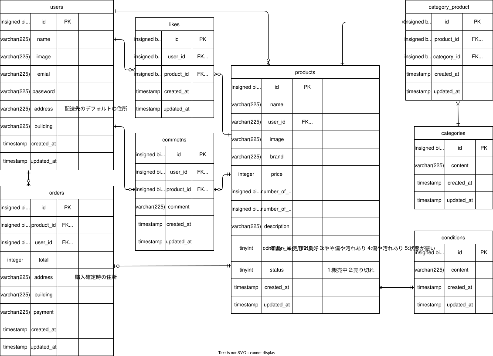

#  :shopping_cart: free-market-test
coachtech模擬案件　フリマアプリ
## :clipboard:laravel環境構築
**🐳Dockerビルド**
1. gitのクローン
```bash
git@github.com:RINGO-days/free-market-test.git
```
2. Dockerデスクトップアプリを立ち上げる

3. Dockerの立ち上げ
```bash
docker-compose up -d --build
```
<details>
<summary style="cursor: pointer;">⚠️ Mac(Apple Silicon)をお使いの方</summary>

>Apple Silicon搭載のMacでは、sail up -d実行時に以下のエラーが発生することがあります
>### 🚫症状
>`The requested image's platform (linux/amd64) does not match the detected host platform`
>などの警告が出て、作業が終了する場合がある。
>### 💡対策
>docker-compose.ymlを開き、プラットフォームを明示する。
>```text
>mysql:
>        image: mysql:8.0.26
>        platform: linux/amd64　←この行を追加
>        environment:
>        〜
>```

</details>

## 🌲環境構築
**Dockerを立ち上げた後は、以下の手順を順番に実行してください**
### 1. phpコンテナへログイン
```bash
docker-compose exec php bash
```
### 2. ライブラリのインストール
```bash
composer install
```
### 3. 環境設定ファイルの作成
```bash
cp .env.example .env
```
### 4. .envファイルの設定（VScodeなどのエディタで編集）
```text
# .envファイル内

---DB設定---
DB_CONNECTION=mysql
DB_HOST=mysql   ※変更
DB_PORT=3306
DB_DATABASE=laravel_db  ※変更
DB_USERNAME=laravel_user    ※変更
DB_PASSWORD=laravel_pass    ※変更
...
```
🔐**<a href="https://dashboard.stripe.com/test/apikeys">stripe APIキー</a>** ←こちらから公開可能キーならびにシークレットキーをコピペしてください
```text
---stripeのAPIキー設定---
STRIPE_PUBLIC_KEY=pk_test_xxxxxxxx      ←
STRIPE_SECRET_KEY=sk_test_xxxxxxxx      ←値を貼り付け
```
<details>
<summary style=" cursor: pointer";>⚠️stripeアカウントをお持ちでない方はこちら</summary>

>1. <a href="https://dashboard.stripe.com/register">Stripe公式サイト</a>で、アカウント（無料）を作成
>2. ダッシュボードの「開発者」＞「APIキー」から、テストモードの「公開可能キー」と「シークレットキー」を取得します。
>3. .env ファイルの以下の項目に値を貼り付けてください。
>```text
>STRIPE_KEY=pk_test_...
>STRIPE_SECRET=sk_test_...
>```

</details>

### 5. アプリケーションキーの作成
```bash
php artisan key:generate
```
### 6. データベースおよび初期データの投入
```bash
php artisan migrate --seed
```
### 7. 商品画像用のストレージの公開
```bash
php artisan storage:link
```
## 🛋テスト環境
### **stripeのサンドボックスでカード支払いのテスト決済を行う場合**

| 項目 | 入力内容 |
| :--- | :--- |
| **カード番号** | `4242 4242 4242 4242` |
| **有効期限** | 未来の日付（例：`01/30`） |
| **CVC** | 任意の3桁（例：`123`） |
| **郵便番号** | 任意の数字（例：`000-0000`） |
| **カード名義** | 任意の文字（例：`Test Test`）

### **コンビニ支払いでテストを行う場合**
1. ターミナル内カレントディレクトリで下記のコマンドを入力し、ローカルでwebhookを受け取れる状態にする
```bash
stripe listen --forward-to localhost/stripe/webhook
```
2. 商品購入画面でコンビニ支払いを選択し購入するをクリックし、stripeのチェックアウト画面に、メールアドレス、氏名、電話番号（任意）を入力した後、支払いボタンをクリック
3. 別のターミナルを開き、強制的にコンビニ支払いを完了させるコマンドを入力する。（stripeでは決済完了にはならないが、作成したフリマアプリ内では決済が完了する）
```bash
stripe trigger checkout.session.completed
```
## 🛠使用技術
- Laravel 8.83.29
- PHP 8.1.34
- mysql 8.0.26
- nginx 1.21.1
- phpMyAdmin
- MailHog
- Fortify
- stripe決済
## 📍開発環境
- http://localhost ホーム画面
- http://localhost:8080 phpMyAdmin
- http://localhost:8025 MailHog
## 📃ER図

# :beginner:その他追加機能
## :pushpin:sold表示済みの商品の購入制限
- 商品のステータスが購入済みの場合、商品詳細画面において、購入画面へのリンクではなく、在庫切れのメッセージを表示するように変更
## :pushpin:未ログインユーザーのヘッダー変更
- 未ログインユーザーに対してはヘッダー内のログイン表示、ログインユーザに対してはログアウト表示
## :pushpin:zipcloudを用いた郵便番号による住所自動入力機能（２パターン）
**zipcloud APIを使用。「住所を検索」ボタンを押すことによって自動で住所の入力欄に住所を入れる機能を実装**
- laravelの機能であるHTTPファサードを用いた方法。ボタンを押すとブラウザのリロードが入り、プロフィール画像を選択していた場合はリセットされてしまう。またリロードにより若干のタイムラグが入ってしまう
- JavaScriptを用いたリロードを挟まない自動入力。ユーザー体験（UX）としてはこちらが勝る。
### 作成したルート
api.php
```bash
Route::post('addressSearch',[ProfileController::class,'addressSearch']);
```
## :pushpin:JavaScriptを用いたプロフィール画像プレビュー機能
- **初回登録時のプロフィール登録画面およびマイリストのプロフィール編集画面、商品出品画面において、選択画像のプレビュー機能を実装**
- src/public/にjs/preview.jsを作成し、auth/profile.blade.php内で使用。
#### 参考文献
- （書籍）<a href="https://www.amazon.co.jp/1%E5%86%8A%E3%81%A7%E3%81%99%E3%81%B9%E3%81%A6%E8%BA%AB%E3%81%AB%E3%81%A4%E3%81%8FJavaScript%E5%85%A5%E9%96%80%E8%AC%9B%E5%BA%A7-Mana/dp/4815615756/ref=asc_df_4815615756?mcid=28f7a8ed18ae32cd87c62ffa05be06d6&th=1&psc=1&tag=jpgo-22&linkCode=df0&hvadid=707442440829&hvpos=&hvnetw=g&hvrand=16030691145050053060&hvpone=&hvptwo=&hvqmt=&hvdev=c&hvdvcmdl=&hvlocint=&hvlocphy=9245132&hvtargid=pla-1944051673189&psc=1&hvocijid=16030691145050053060-4815615756-&hvexpln=0">一冊ですべて身に付くJavaScript入門講座</a>
- <a href="https://zenn.dev/tatsuyasusukida/articles/javascript-image-preview">参考サイト</a>
